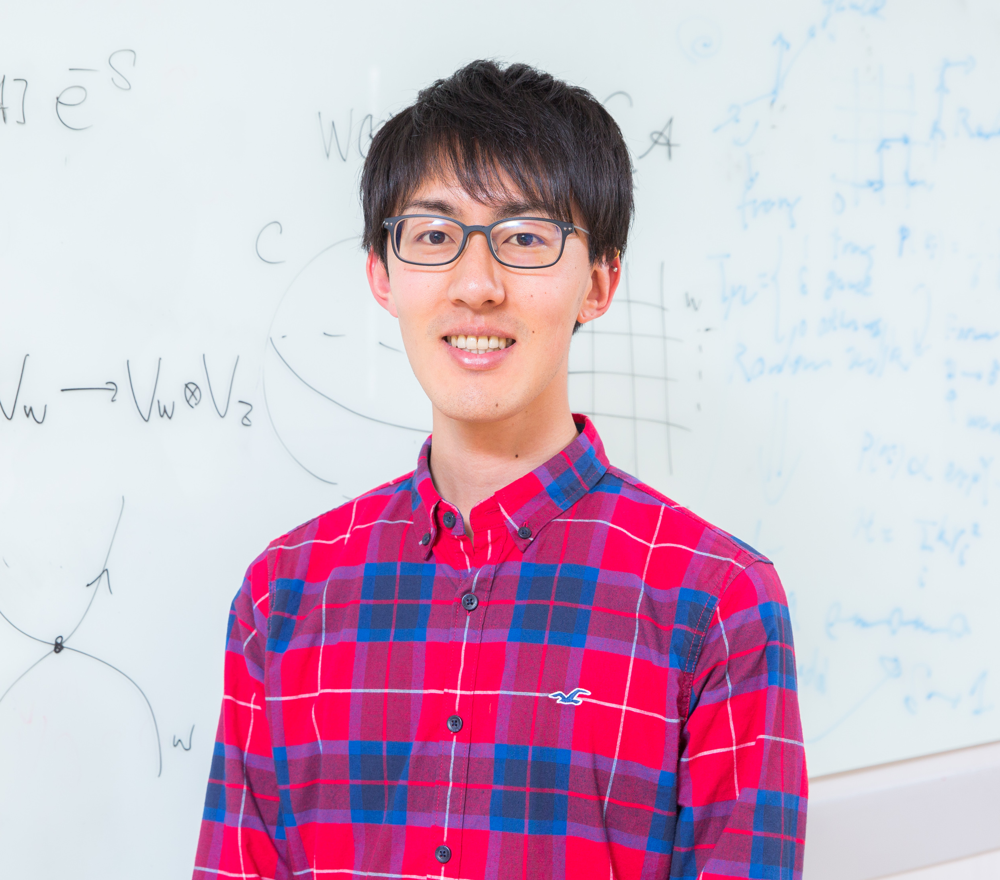

# About Me

## Toshihiro Ota

Research Scientist, AI Lab, CyberAgent, Inc.
Visiting Scientist, iTHEMS, RIKEN
Email: toshihiro.ota12 at gmail.com

  

<!-- comment
  @import "./photo.jpg" {width='40%' title='photo'}
-->

### Personal

- Current address: 2-24-12 Shibuya, Tokyo 150-6121, Japan
- Citizenship: Japan
- Born on May, 1991
- Ph.D. in Physics, March 2021

### Research Interests

I have been interested in fundamental issues on quantum field theory and string theory, and also the related topics in mathematical physics. My research uses mathematical tools developed by string theory to explore non-perturbative aspects of quantum field theories. My current focus is, in particular, on the study of integrable structure behind string theory and gauge theories.

Recently, I am also interested in the interaction between machine learning and practical problems in our real world. I believe that machine learning and deep learning are one of the most powerful tools to explore fundamental problems and pursue totally new developments that we could not reach ever. My particular interest in this direction is ***theoretical physics for machine learning***. (That is NOT machine learning for theoretical physics!)

### Tools and Languages:

  
  
  
  
  
  
  
  

---

More detail information is available [here](./cv.pdf).
